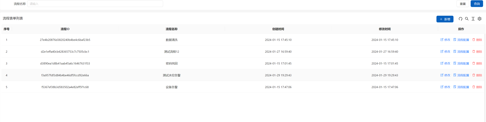
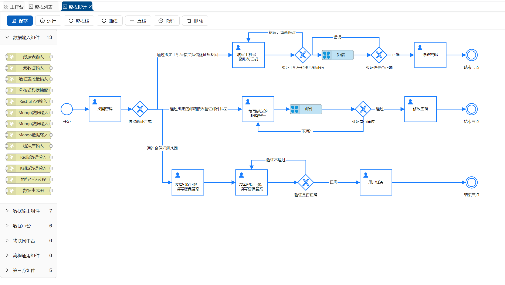

 
 
 

***严肃声明：此项目基于  [ruoyi-vue-pro](https://github.com/YunaiV/ruoyi-vue-pro)  开发！***

## 🐯 平台简介

本项目在 [ruoyi-vue-pro](https://github.com/YunaiV/ruoyi-vue-pro)  的基础上开发，本文档只介绍新增功能，运行使用说明直接查看  [ruoyi-vue-pro](https://github.com/YunaiV/ruoyi-vue-pro)  项目文档。感谢  [ruoyi-vue-pro](https://github.com/YunaiV/ruoyi-vue-pro)  项目团队的辛勤付出。

## 😎 开源协议

本项目与 [ruoyi-vue-pro](https://github.com/YunaiV/ruoyi-vue-pro)  一样采用比 Apache 2.0 更宽松的 [MIT License]) 开源协议，个人与企业可 100% 免费使用，不用保留类作者、Copyright 信息。

## 🐼 新增功能

在 [ruoyi-vue-pro](https://github.com/YunaiV/ruoyi-vue-pro) 项目的基础上，新增了规则引擎，可以用于快速开发务系统：

* 规则引擎

### 规则引擎

|      | 功能         | 描述                             |
| ---- | ------------ | -------------------------------- |
| 🚀    | 业务规则列表 | 管理引擎的编排规则               |
| 🚀    | 业务流程设计 | 设计业务流程以及流程代码脚本编写 |

## 🐷 演示图

### 规则引擎
| 模块          | 图片                         | 图片                                 |
| ------------- | --------------------------------- | ------------------------------------- |
| 业务规则列表 |  |      |
| 规则 引擎业务设计 |  |  |
## 🐨 技术栈

### 模块

|                         |                      |
| ----------------------- | -------------------- |
| `ymitcloud-module-rule` | 规则引擎 Module 模块 |

### 框架

| 框架                                                         | 说明                  | 版本           | 学习指南                                                     |
| ------------------------------------------------------------ | --------------------- | -------------- | ------------------------------------------------------------ |
| [Spring Boot](https://spring.io/projects/spring-boot)        | 应用开发框架          | 3.2.0          | [文档](https://github.com/YunaiV/SpringBoot-Labs)            |
| [MySQL](https://www.mysql.com/cn/)                           | 数据库服务器          | 5.7 / 8.0+     |                                                              |
| [Druid](https://github.com/alibaba/druid)                    | JDBC 连接池、监控组件 | 1.2.20         | [文档](http://www.ymitcloud.com/Spring-Boot/datasource-pool/?yudao) |
| [MyBatis Plus](https://mp.baomidou.com/)                     | MyBatis 增强工具包    | 3.5.4.1        | [文档](http://www.ymitcloud.com/Spring-Boot/MyBatis/?yudao)  |
| [Dynamic Datasource](https://dynamic-datasource.com/)        | 动态数据源            | 4.2.0          | [文档](http://www.ymitcloud.com/Spring-Boot/datasource-pool/?yudao) |
| [Redis](https://redis.io/)                                   | key-value 数据库      | 5.0 / 6.0 /7.0 |                                                              |
| [Redisson](https://github.com/redisson/redisson)             | Redis 客户端          | 3.25.0         | [文档](http://www.ymitcloud.com/Spring-Boot/Redis/?yudao)    |
| [Spring MVC](https://github.com/spring-projects/spring-framework/tree/master/spring-webmvc) | MVC 框架              | 6.1.1          | [文档](http://www.ymitcloud.com/SpringMVC/MVC/?yudao)        |
| [Spring Security](https://github.com/spring-projects/spring-security) | Spring 安全框架       | 6.2.0          | [文档](http://www.ymitcloud.com/Spring-Boot/Spring-Security/?yudao) |
| [Hibernate Validator](https://github.com/hibernate/hibernate-validator) | 参数校验组件          | 8.0.1          | [文档](http://www.ymitcloud.com/Spring-Boot/Validation/?yudao) |
| [Flowable](https://github.com/flowable/flowable-engine)      | 工作流引擎            | 7.0.0          | [文档](https://doc.ymitcloud.com/bpm/)                       |
| [Quartz](https://github.com/quartz-scheduler)                | 任务调度组件          | 2.3.2          | [文档](http://www.ymitcloud.com/Spring-Boot/Job/?yudao)      |
| [smart-doc](https://smart-doc-group.github.io/#/)            | smart-doc 文档        | 2.2.0          | [文档](https://smart-doc-group.github.io/#/zh-cn/?id=smart-doc) |
| [Resilience4j](https://github.com/resilience4j/resilience4j) | 服务保障组件          | 2.1.0          | [文档](http://www.ymitcloud.com/Spring-Boot/Resilience4j/?yudao) |
| [SkyWalking](https://skywalking.apache.org/)                 | 分布式应用追踪系统    | 9.0.0          | [文档](http://www.ymitcloud.com/Spring-Boot/SkyWalking/?yudao) |
| [Spring Boot Admin](https://github.com/codecentric/spring-boot-admin) | Spring Boot 监控平台  | 3.1.8          | [文档](http://www.ymitcloud.com/Spring-Boot/Admin/?yudao)    |
| [Jackson](https://github.com/FasterXML/jackson)              | JSON 工具库           | 2.15.3         |                                                              |
| [MapStruct](https://mapstruct.org/)                          | Java Bean 转换        | 1.5.5.Final    | [文档](http://www.ymitcloud.com/Spring-Boot/MapStruct/?yudao) |
| [Lombok](https://projectlombok.org/)                         | 消除冗长的 Java 代码  | 1.18.30        | [文档](http://www.ymitcloud.com/Spring-Boot/Lombok/?yudao)   |
| [JUnit](https://junit.org/junit5/)                           | Java 单元测试框架     | 5.10.1         | -                                                            |
| [Mockito](https://github.com/mockito/mockito)                | Java Mock 框架        | 5.7.0          | -                                                            |
| [LiteFlow](https://liteflow.cc/)                             | 流程编排规则引擎      | 2.11.4         |                                                              |
